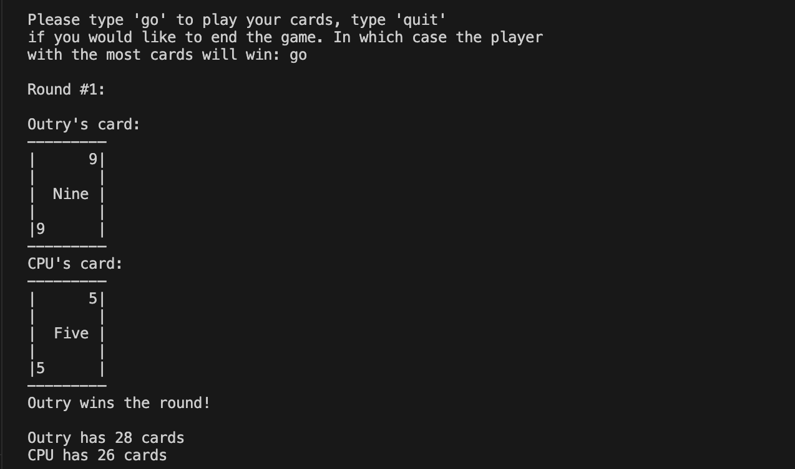
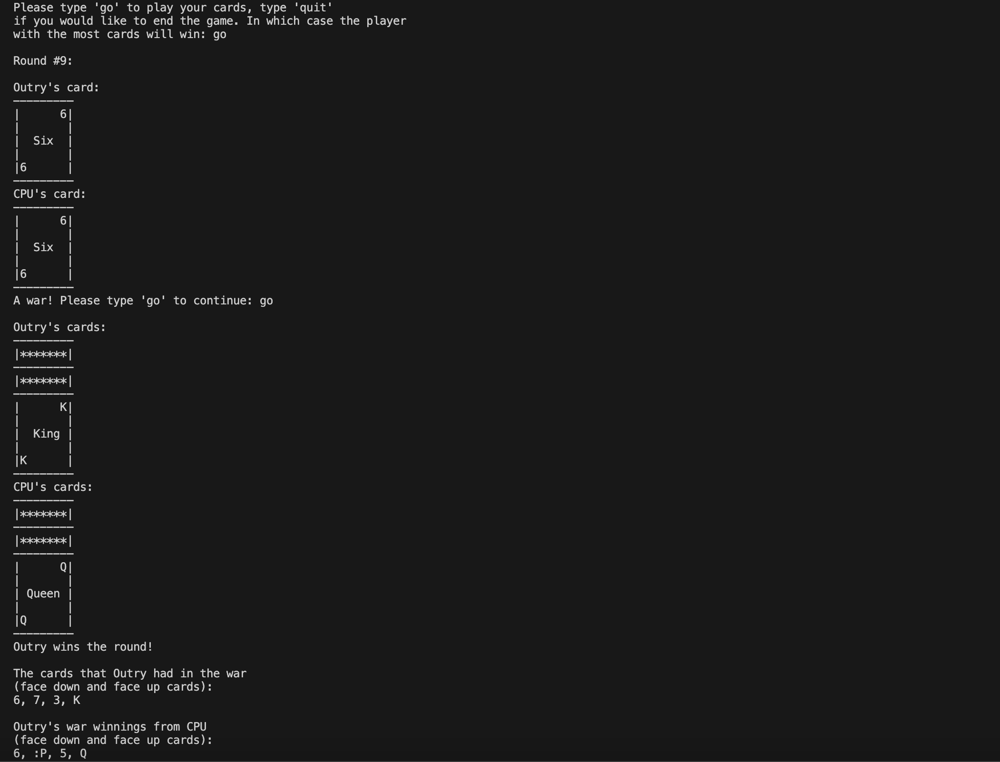
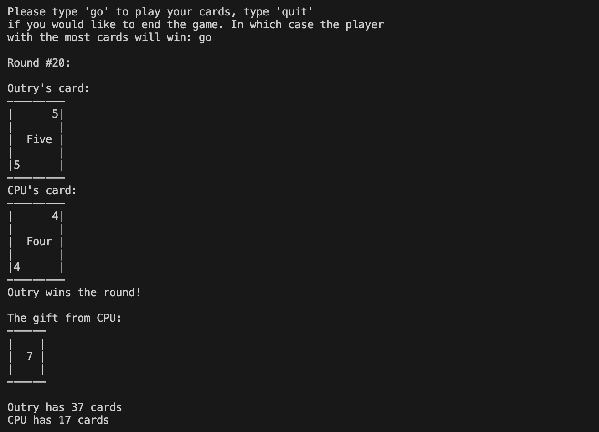

## Author
Ryan McKinnon

## Name
War Card Game

## Description
A text-based recreation of the Card Game War in Java. Includes wars in the events of ties, as well as house rules like single-card gifts, and a turn counter that increases the amount of cards that trade hands as the game goes on.

## Visuals
Basic Turn Image:

War Turn Image (Occurs in event of tie):

Gift Turn Image (Occurs in event of win by one card value):

## Roadmap
Adding a GUI to this game instead of it just being text-based.
Possible online multiplayer component.

## Project status
Stopped for the time being.
